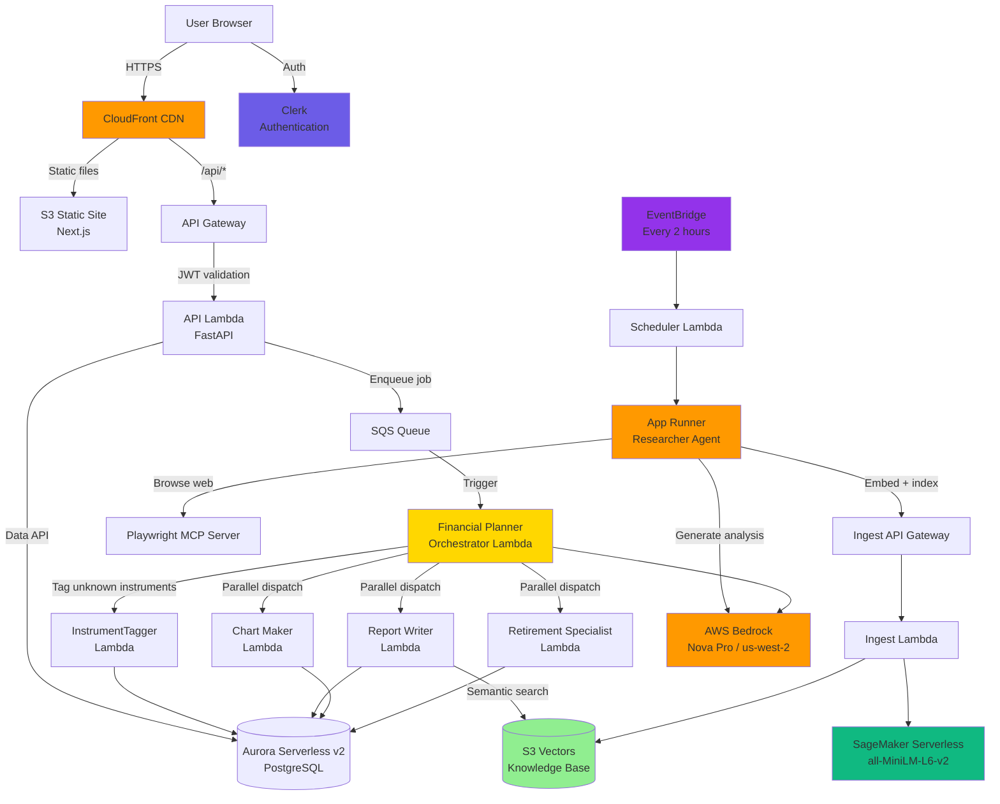
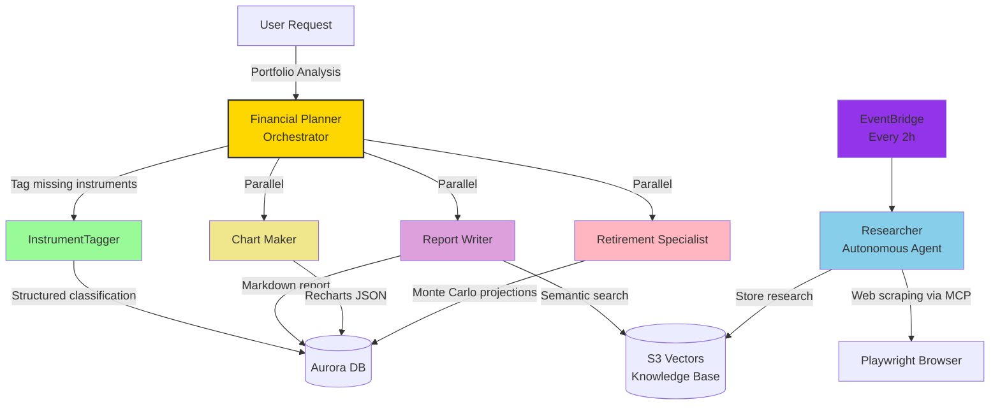
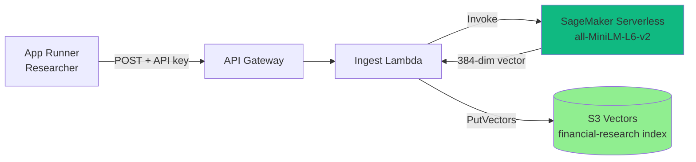
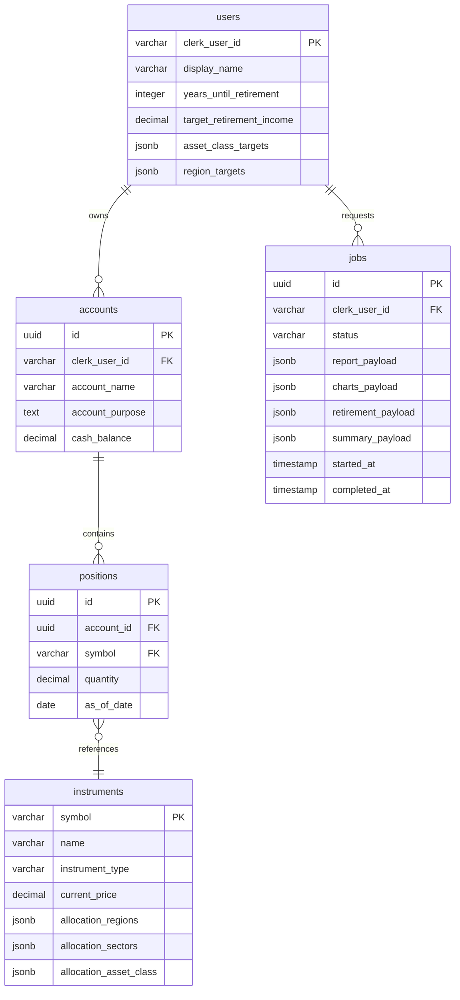

# Alex - the Agentic Learning Equities Explainer

## Multi-agent Enterprise-Grade SaaS Financial Planner

---

## Demo

🎬 [Watch the full demo video](https://drive.google.com/file/d/1Qe9NpkxsY-7UPKQbOUvDrSZR9QQI8FQt/view?usp=sharing)

  

  

  

  

---

## What is Alex?

Alex is a full-stack AI financial planning platform that helps users understand their investment portfolios, model retirement scenarios, and receive personalized research-backed recommendations. It is deployed entirely on AWS serverless infrastructure and powered by a multi-agent AI architecture using AWS Bedrock foundation models.

The system autonomously gathers market intelligence every two hours via a scheduled Researcher agent, embeds and indexes findings into a vector knowledge base, and surfaces that knowledge to a coordinated team of specialized AI agents whenever a user requests a portfolio analysis. The entire stack, from embedding model to frontend CDN, runs serverless, meaning there are no idle servers to manage and the infrastructure scales to exactly what the workload demands.

Deployment of a complete production AI system featuring:

- **Multi-agent collaboration**: 5 specialized AI agents working together via orchestration
- **Serverless architecture**: Lambda, Aurora Serverless v2, App Runner, API Gateway, SQS
- **Cost-optimized vector storage**: S3 Vectors (90% cheaper than OpenSearch)
- **Real-time financial analysis**: Portfolio management, retirement projections, market research
- **Production-grade practices**: Observability, guardrails, security, monitoring
- **Full-stack application**: NextJS React frontend with Clerk authentication

---

## System Architecture

---

## Agent Orchestra

Rather than relying on a single monolithic prompt to do everything, Alex delegates work to six specialized agents. This matters enormously in practice: smaller, focused prompts are more reliable, easier to test, and far simpler to improve without breaking unrelated behavior. Each agent is a Lambda function with its own IAM role, its own timeout budget, and one clearly defined job to do.

### Agent Responsibilities

| Agent                     | Trigger              | Output                                               | Approx. Duration |
| ------------------------- | -------------------- | ---------------------------------------------------- | ---------------- |
| **Financial Planner**     | SQS message          | Orchestrated job result                              | 2–3 min          |
| **InstrumentTagger**      | Called by Planner    | Structured JSON, asset class, region, sector         | 5–10 s           |
| **Researcher**            | EventBridge every 2h | Markdown research articles stored in S3 Vectors      | 30–60 s          |
| **Report Writer**         | Called by Planner    | Markdown portfolio analysis with recommendations     | 20–30 s          |
| **Chart Maker**           | Called by Planner    | Recharts-compatible JSON, pie, bar, donut charts     | 10–15 s          |
| **Retirement Specialist** | Called by Planner    | Monte Carlo projections + retirement readiness score | 20–30 s          |

### Orchestration Patterns

**Sequential enrichment**, before any analysis begins, the Planner checks whether all instruments in the portfolio have been classified. If not, it delegates to the InstrumentTagger first. This keeps reference data clean and avoids sending incomplete context to downstream agents.

**Parallel execution**, once enrichment is done, the Reporter, Charter, and Retirement Specialist are dispatched simultaneously. There is no reason to wait for a narrative report before generating charts; running them in parallel cuts total analysis time roughly in half.

**Isolated writes**, each agent writes exclusively to its own JSONB column in the `jobs` table (`report_payload`, `charts_payload`, `retirement_payload`, `summary_payload`). This design choice eliminates any risk of concurrent write conflicts and makes it trivial to inspect or replay a single agent's output independently.

**Autonomous research loop**, the Researcher operates on its own schedule, completely decoupled from the analysis pipeline. It continuously enriches the S3 Vectors knowledge base so that when the Reporter runs a semantic search, it finds fresh, relevant market context rather than stale snapshots.

**Graceful degradation**, if one agent fails, the Planner surfaces whatever succeeded. A broken Chart Maker does not invalidate a perfectly good retirement analysis.

---

## Ingestion Pipeline

Every piece of research the Researcher agent produces passes through a dedicated ingestion pipeline before it becomes searchable. This separation matters: embedding is computationally non-trivial, and keeping it in a dedicated Lambda with its own SageMaker endpoint means the cost and latency of indexing never affect the user-facing API.

The SageMaker endpoint uses the HuggingFace container runtime, which downloads `all-MiniLM-L6-v2` automatically on first invocation, no model artifact preparation, no custom container. Because ingestion runs on a schedule and not on the critical path of a user request, the 10–60 second cold start of a serverless endpoint is entirely acceptable, and the endpoint spending most of its time scaled to zero is exactly what keeps costs low.

---

## Data Model

Allocation data, the percentage breakdowns by region, sector, and asset class, is stored as PostgreSQL JSONB rather than in separate relational tables. This keeps the schema flexible as new allocation dimensions are added, while Pydantic validation on every write enforces that percentages always sum to 100%. The `instruments` table is seeded with 22 popular ETFs (SPY, QQQ, BND, VTI, and others) and enriched progressively at runtime by the InstrumentTagger as new symbols appear in user portfolios.

---

## Technology Stack

### AI & ML

- **AWS Bedrock**, Amazon Nova Pro (`us.amazon.nova-pro-v1:0`), region `us-west-2`, accessed cross-region from the application layer. Nova Pro was chosen over the OpenAI OSS 120B model for its significantly better tool-calling reliability and higher rate limits, both critical properties in a multi-agent system where one flaky tool call can cascade into a failed job.
- **SageMaker Serverless Endpoint**, `sentence-transformers/all-MiniLM-L6-v2`, 384-dimension embeddings via the HuggingFace container runtime. Scales to zero between ingestion runs.
- **OpenAI Agents SDK**, agent orchestration and runner loop. LiteLLM acts as the model adapter layer, translating the SDK's OpenAI-format calls into Bedrock API calls transparently.
- **Playwright MCP Server**, a Model Context Protocol server that gives the Researcher agent a real browser. Rather than scraping static HTML, the agent can interact with dynamic financial websites exactly as a human would, navigating, clicking, and reading live data.
- **Polygon.io API**, real-time and end-of-day stock price data. The Planner refreshes instrument prices via Polygon before each analysis so that portfolio valuations are always current.

### Storage & Data

- **S3 Vectors**, AWS-native vector storage; index `financial-research`, Cosine distance, 384 dimensions. The appeal of S3 Vectors is not just cost (~90% cheaper than OpenSearch Serverless) but operational simplicity: there is no cluster to provision, no capacity to plan, and no VPC endpoint to configure. You put vectors in and get vectors back.
- **Aurora Serverless v2 PostgreSQL** (`eu-west-1`), the relational core of the platform. Accessed exclusively via the RDS Data API, which exposes database queries over HTTP. This eliminates the need for VPC networking between Lambda and the database, removing the single most common source of complexity in serverless-to-RDS integrations.
- **AWS Secrets Manager**, Aurora credentials stored with KMS encryption, referenced by ARN. No credentials ever touch application code or environment variable plaintext.

### Compute

- **AWS App Runner** (`eu-west-1`), hosts the Researcher agent as a long-running containerized service. App Runner handles load balancing, TLS, and auto-scaling automatically, making it the right choice for a stateless service that needs to survive 60-second web browsing sessions without Lambda's execution time constraints.
- **AWS Lambda**, six functions: Financial Planner (300 s timeout, 3 GB RAM), Reporter, Charter, Retirement Specialist, InstrumentTagger (60 s each), and the API backend (FastAPI). Each function is packaged with Docker to guarantee Linux/amd64 compatibility regardless of the developer's machine architecture.
- **API Gateway (HTTP API)**, two independent instances: one for the user-facing REST API (Clerk JWT validation, CORS, throttling) and one for the ingest pipeline (API key authentication). Keeping them separate ensures that a burst of ingestion traffic cannot consume capacity reserved for user requests.
- **CloudFront + S3**, the Next.js static export is served from S3 via a CloudFront distribution. Static assets are cached globally at the edge, meaning a user in Paris and a user in Tokyo both get sub-50ms response times for the frontend, regardless of where the S3 bucket lives.

### Automation & Scheduling

- **EventBridge Scheduler**, fires every 2 hours (`eu-west-1`, currently enabled) to trigger a new research cycle. The schedule is defined in Terraform and can be toggled via a `scheduler_enabled` variable to pause automated research during development without destroying any infrastructure.
- **Lambda Scheduler**, a small intermediary Lambda that sits between EventBridge and App Runner. This exists because EventBridge API Destinations enforce a hard 5-second HTTP timeout, but research tasks routinely take 20–60 seconds. The Lambda accepts the EventBridge event and calls App Runner asynchronously, completely decoupling schedule timing from execution duration.
- **SQS**, analysis jobs are enqueued to SQS by the API Lambda and consumed by the Financial Planner. This decoupling is what makes the analysis pipeline resilient: if the Planner Lambda is throttled or temporarily unavailable, jobs queue up safely rather than being dropped. A dead-letter queue captures messages that fail repeatedly for later inspection.

### Frontend

- **Next.js**, React framework with static export. The entire frontend is a collection of HTML, CSS, and JavaScript files, no server-side rendering, no Node.js process to keep running. This keeps hosting cost negligible and deployment trivially simple.
- **Clerk**, handles the entire authentication surface: sign-up, sign-in, session management, and JWT issuance. On first sign-in, the API Lambda automatically provisions a user record in Aurora, so the application never needs to implement a registration flow.
- **Recharts**, portfolio visualizations are rendered directly from the JSON that the Charter agent produces. The agent is explicitly prompted to output Recharts-compatible data structures, making the frontend consumption completely straightforward.
- **Tailwind CSS**, utility-first styling.

### Observability

- **Langfuse** (configured, `https://cloud.langfuse.com`), LLM tracing via Pydantic Logfire and OpenTelemetry. Instrumentation is attached at the OpenAI Agents SDK level, meaning every model call, tool invocation, and agent handoff is captured automatically without any per-agent logging code. Each Lambda handler wraps its execution in a `with observe():` context manager that guarantees traces are flushed before the function exits, a critical detail given that Lambda freezes the execution environment immediately after the handler returns.
- **CloudWatch**, structured JSON logs from all agents and the API backend, custom dashboards for Bedrock token consumption and SageMaker invocation metrics, Lambda error rate and duration panels.
- **CloudWatch Alarms**, error rate and duration thresholds on all Lambda functions, wired to SNS for email notification.

### Infrastructure as Code

- **Terraform**, fully modular, one directory per component (`2_sagemaker`, `3_ingestion`, `4_researcher`, `5_database`, `6_agents`, `7_frontend`, `8_enterprise`). Each component uses local state and can be deployed or destroyed independently, making it straightforward to tear down expensive resources like Aurora when not actively developing without touching the rest of the stack.

---

## Security

Good security in a serverless architecture is mostly about discipline, keeping permissions narrow, keeping secrets out of code, and validating everything at the boundary before it reaches business logic.

**IAM least privilege**, every Lambda function has its own IAM role scoped to exactly the actions it needs. The Financial Planner can invoke the four agent Lambdas and read from Aurora, but nothing else. The Ingest Lambda can call SageMaker and write to S3 Vectors, but has no access to user data. This means a compromised function cannot pivot laterally across the system.

**JWT authentication**, every request to the user-facing API is validated against Clerk's JWKS endpoint before any database query runs. Clerk automatically rotates its signing keys, and because validation always fetches from the JWKS endpoint, the application picks up new keys without any deployment.

**Dual API authentication**, the ingest pipeline uses API key authentication entirely separate from Clerk. This means the Researcher agent authenticates as a service, not as a user, and its credentials can be rotated independently.

**Input sanitization**, before any user-derived text reaches an agent prompt, it is scanned for common prompt injection patterns. A matched pattern results in the input being rejected outright, not sanitized and passed through.

**Output validation**, the Charter agent's JSON output is validated against expected structure before being written to the database. A malformed response returns a safe fallback rather than persisting broken data that would crash the frontend.

---

## Guardrails & Explainability

The goal of guardrails in an agentic system is not to prevent AI from being creative, it is to prevent AI errors from silently propagating into user-facing results.

**Structured outputs with forced reasoning**, the InstrumentTagger uses the OpenAI Agents SDK's structured output mode to return a typed `InstrumentClassification` Pydantic object. Critically, the `rationale` field appears _before_ the classification fields in the schema definition. This forces the model to articulate its reasoning before committing to a label, which empirically produces more accurate and auditable classifications than asking for a rationale after the fact.

**Exponential backoff**, all agent invocations are wrapped with `tenacity`, retrying automatically on rate-limit errors and transient timeouts with exponential backoff. In a multi-agent system making many Bedrock calls in parallel, hitting rate limits occasionally is not an error condition, it is a normal operating state that the system handles transparently.

**Response size limits**, agent outputs are capped before being stored. Without this, a model generating an unusually verbose response could silently exhaust JSONB storage or cause downstream rendering issues.

**Explainable recommendations**, the Reporter agent's prompt template requires each recommendation to include explicit reasoning, expected impact, and priority level. This is not just good UX; it makes it possible to audit why the system suggested a specific portfolio change, which matters in a financial context.

---

## Estimated Monthly Cost

One of the deliberate goals of this architecture was to keep the full stack running at a cost that is reasonable for a personal or small-team project, without sacrificing production-grade components. Every service choice reflects a cost/capability tradeoff.

| Service                                       | Estimate       |
| --------------------------------------------- | -------------- |
| Aurora Serverless v2 (0.5 ACU min, eu-west-1) | ~$22           |
| App Runner (Researcher, eu-west-1)            | ~$8            |
| S3 Vectors (index storage + queries)          | ~$3            |
| SageMaker Serverless Endpoint (scale-to-zero) | ~$2            |
| Lambda, 6 functions (pay per invocation)      | ~$2            |
| API Gateway, 2 instances                      | ~$1            |
| CloudFront + S3 static hosting                | < $1           |
| Bedrock, Nova Pro (per analysis, ~$0.05)      | ~$1            |
| CloudWatch, SQS, Secrets Manager              | ~$1            |
| **Total (all services running)**              | **~$40/month** |

Aurora is the dominant cost driver at ~55% of the bill. It is the only service that incurs a baseline charge regardless of activity, because the cluster must remain available to serve user requests. Every other component in the stack scales to zero, if no one is using Alex, the bill for those services rounds to zero.

---

## Key Design Decisions

**S3 Vectors over OpenSearch Serverless**, OpenSearch Serverless requires a minimum of two OCUs (around $350/month) even for the smallest workload. S3 Vectors has no minimum capacity and charges only for storage and query volume, making it the only viable option for a vector store at this budget. The tradeoff is a less mature API and no filtering beyond cosine similarity, which is sufficient for this use case.

**Aurora Data API over standard RDS**, a traditional RDS PostgreSQL instance behind a VPC requires security groups, subnet groups, NAT gateways, and persistent connection management, all of which add infrastructure complexity and cost. The Aurora Data API exposes SQL over HTTP, letting Lambda query the database with a simple API call. The per-query overhead is slightly higher, but it removes an entire layer of networking infrastructure that would otherwise dominate the deployment complexity.

**SageMaker Serverless for embeddings**, the alternative was calling a Bedrock embedding model directly, which is simpler but locks embedding quality to whatever AWS offers. Using `all-MiniLM-L6-v2` on SageMaker gives full control over the model and its output dimensions, and the HuggingFace container runtime means the deployment is a single Terraform resource with no custom Docker work required.

**Isolated agent writes**, writing each agent's output to its own JSONB column rather than a shared result object is what makes true parallel execution safe. There are no locks, no merge conflicts, and no risk that a slow agent blocks a fast one from persisting its result. It also means that re-running a single failed agent does not require re-running the entire pipeline.

**Langfuse via Pydantic Logfire**, manually instrumenting each agent with tracing calls would require modifying every handler and would couple observability logic to business logic. Logfire attaches to the OpenAI Agents SDK at the framework level, so every model call and tool invocation is captured without a single line of tracing code in the agents themselves.

**EventBridge → Lambda → App Runner chain**, the five-second timeout on EventBridge API Destinations is a hard platform limit that cannot be worked around at the EventBridge level. Rather than fighting the constraint, a small scheduler Lambda accepts the event and calls App Runner asynchronously, making the execution time of the research task invisible to the scheduler.

---

## Acknowledgements

A heartfelt thank you to **Ed Donner** for his precious help, his passion for this field is contagious, and the depth of what he shares is rare. 🙏🙏🙏
